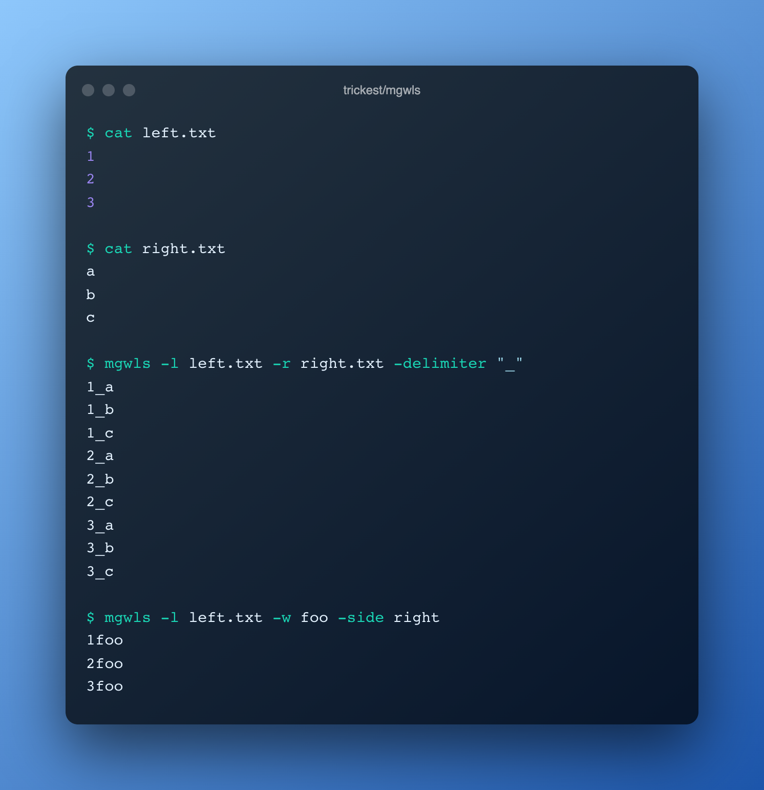

<h1 align="center">mgwls <a href="https://twitter.com/intent/tweet?text=mgwls%20-%20Combine%20words%20from%20two%20wordlist%20files%20and%20concatenate%20them%20with%20an%20optional%20delimiter%20%40trick3st%0Ahttps%3A%2F%2Fgithub.com%2Ftrickest%2Fmgwls&hashtags=bugbounty,bugbountytips,infosec"></a></h1>
<h3 align="center">Merge wordlists</h3>



Combine words from two wordlist files and concatenate them with an optional delimiter

# Installation
## Binary
Binaries are available in the [latest release](https://github.com/trickest/mgwls/releases/latest).

## Docker
```
docker run quay.io/trickest/mgwls
```

## From source
```
go install github.com/trickest/mgwls@latest
```

# Usage
```
  -delimiter string
        String delimiter to place between words
  -l string
        Wordlist file (left side)
  -side
        Flag that determines the side of the single word
  -o string
        Output file (optional)
  -r string
        Wordlist file (right side)
  -w string
        Single word to use for concatenation
```

### Examples
##### left.txt
```
1
2
3
```

##### right.txt
```
a
b
c
```

```shell script
> mgwls -l left.txt -r right.txt -delimiter "_"
1_a
1_b
1_c
2_a
2_b
2_c
3_a
3_b
3_c
```

```shell script
>  mgwls -l left.txt -w foo -side right
1foo
2foo
3foo
```

# Report Bugs / Feedback
We look forward to any feedback you want to share with us or if you're stuck with a problem you can contact us at [support@trickest.com](mailto:support@trickest.com). You can also create an [Issue](https://github.com/trickest/mgwls/issues/new) or pull request on the Github repository.

# Where does this fit in your methodology?
Mgwls is an integral part of many workflows in the Trickest store. Sign up on [trickest.com](https://trickest.com) to get access to these workflows or build your own from scratch!

[](https://trickest.io/auth/register)
